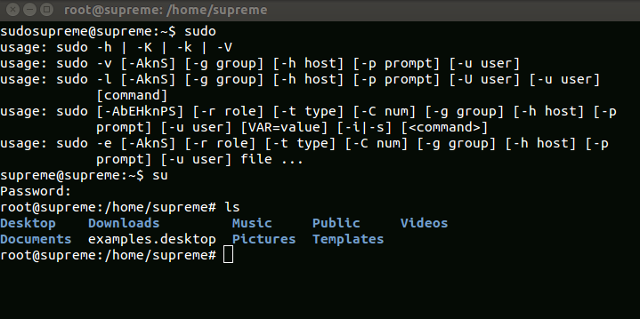
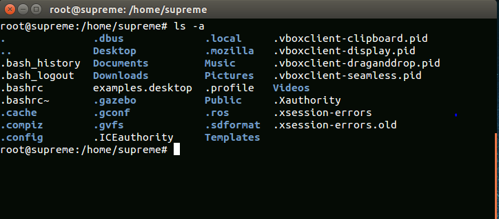
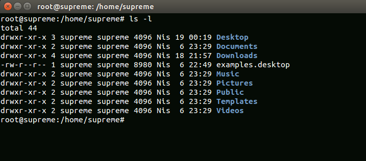
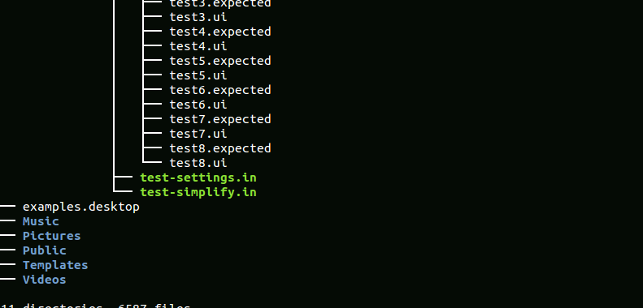
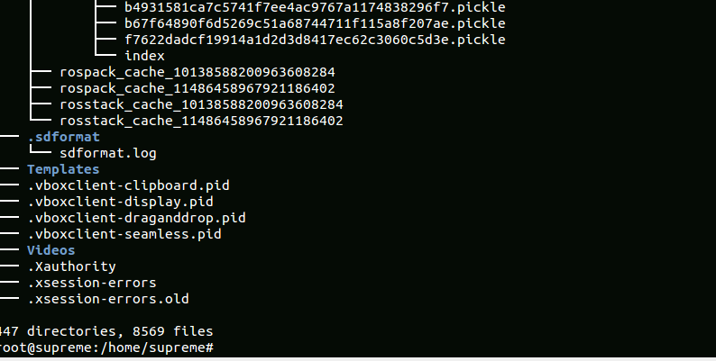
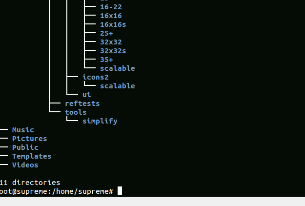
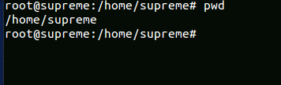
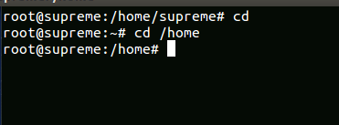
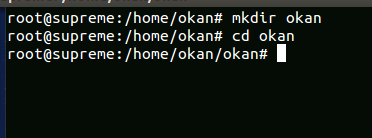

= Dosyalar & Dosya Adları

=== Dosya isimleri herhangi bir karakteri içerebilir.

* abc??##.a1	sta*.pn

=== Fakat dosya isimlerinde özel karakter kullanımı önerilmez.

=== Boşluk kabul edilebilir fakat önerilmez , bunun yerine altçizgi veya tire kullanabilirsiniz.

* test results.txt	=> test_results.txt	veya  test-results.txt

=== Dosya isimleri büyük,küçük harfe duyarlıdır.

* Test_results.doc	test_results.doc

=== Ama aynı isime sahip dosyaları , harf duyarlılığına uyarak oluşturun.

=== Nokta ile başlayan dosya isimleri gizli dosyalardır.

* .bashrc   .profile

=== Nokta sadece bir karakterdir uzantı değildir.

* file.txt.old	.bashrc	file.doc.mod   .profile.old   results.yesterday  results

=== Netlik için popüler uzantılara uymak iyi bir fikirdir.

= Paths (Dizin Yolu)

=== Dizin isimleri eğik çizgiyle ayrılır. ‘/’

* /usr/src/shared/files/myfile.txt

=== Bunlar mutlak ve göreceli olabilirler.

* Mutlak: nerede olduğuna bağlı olmaz.

** /home/aelarabawy/abcd

** ~/abcd

** ~  means /home/aelarabawy	

** ~salah means /home/salah

* Göreceli:nerede olduğu önemlidir.

** ./my-project/progress-reports

** ../../my-project/progress-reports

** .  means Current Directory

** .. Means Parent Directory

= Komutlar

=== Komutların genel şekli,

* $ <komut> [seçenekler] [tartışma]

=== Komutlar kendi başlarına düzenlenebilir.

* $ ls

* $ pwd

* $ cd

=== Şeçenekler isteğe bağlıdır.Genellikle '-' veya '-' ile başlar.‘-’ kısaltmaları için kullanılır.

* $ ls -a

=== ‘--‘ kelimelerin uzun hali için kullanılır.

* $ ls --all

=== Normalde CLI ‘ nın kısa adını ,komut doslarında ise uzun halini kullanırız .

=== Birden fazla seçenekleri beraber kullanmak istiyorsak , seçenekleri birleştirir veya ayrı tutmalıyız.

* $ ls -a -R

* $ ls -aR

* $ ls --all --recursive

=== Bir isim olmadan ‘-- ’ işareti daha sonraki seçenekleri sonlandırabilir.

=== Bağımsız değişkenler komuta dosya adı veya dosya yolu gibi iletilen bilgidir.

* $ rm -rf  ./proje-verisi

== Basit Komutlar

* ls -> dosyaları listelemek için

* tree -> dosyaları ağaca listelemek için

* pwd -> geçerli dizini göstermek için

* cd -> ağaçta gezinmek için

* mkdir -> dizin oluşturmak için

* cp -> dosyaları ve dizinleri kopyalamak için

* mv -> dosyaları ve dizinleri taşımak için

* rm -> dosyaları ve dizinleri silmek için

* clear -> terminal ekranını temizlemek için

== ls Komutları

=== ls (geçerli dizini listele) 

=== ls - a (gizli dosyalarda dahil olmak üzere bütün dosyaları listele)

=== ls - a (dosyaları uzun formatta listeler)

=== Diğer ls komutları

* ls -t -> dosyaları oluşturma zamanına göre listeler

* ls -S -> boyuta göre dosyaları listeler

* ls -r -> tersten sıralama yaparak listeler

* ls -d -> yalnızca dizinleri gösterir

* ls -R -> alt dizinleri gösterir

* ls <dizin veya dosya><dizin veya dosya> -> seçili dosyaları listeler

== tree Komutları

=== tree (geçerli dizinde ağaç listeleme)

=== tree - a (tüm dosyaları gösterir)

=== Diğer tree komutları

* tree - d -> sadece dizinleri gösterir

* tree <dizin> -> ağacı belirtilen dizinden itibaren gösterir.

== pwd Komutu

=== Bulunduğun dizini gösterir.

== cd Komutu

=== Hedeflenen dosya veya dizine gider.

== mkdir Komutu

=== dosya oluşturur.

== cp Komutu 

=== Dosyaları veya dizinleri kopyalar.

== mv Komutu

=== Dosyaları ve dizinleri taşıma işlemi yapar

== rm Komutu 

=== Dosyaları ve dizinleri kaldırma(silme) işlemini gerçekleştirir.

= Wild Cards

=== Bazen tek bir dosya yerine bir grup dosyada bir komutu çalıştırmanız gerekir.
* Örneğin:
** Günlük dosyaların  tamamını silmek istiyorsunuz.
** Tüm resim dosyalarını listelemek istiyorsunuz.
** Eski dosyaları kopyalamak istiyorsunuz. 

=== Bunun çözümü, Wild Card’ ları kullanmaktır. Wild card‘lar, dosya adlarında bir şeyler paylaşan bir dosya / dizin grubuna uygulamak için kullanılan dosya adlarında ve dizin adlarında yer tutucu olarak kullanılan desenlerdir.

=== Sadece dosya adları ve dizin adları için Wild card’ların kullanıldığını unutmayın. Normal metin için gelecekteki bir ders kapsamında ele alınacak başka bir desen kullanılır.

=== "*", Dosya / dizin adındaki herhangi bir karakter kümesinin yerini alabilir.

=== "*", Dosya / dizin adındaki herhangi bir karakter setini değiştirebilir.

== İPUCU

* Bir sürü dosyayı / dizinleri wild card’larla kaldıracaksanız, yanlış yapmadığınızdan ve yanlış dosyaları kaldırdığınızdan emin olmak için bunları önce aynı wild card’la listelemek ve ardından "ls" yerine "rm" veya emin değilseniz, silinmeden önce her dosyanın silinmesini onaylamak için '-i' kullanın.

